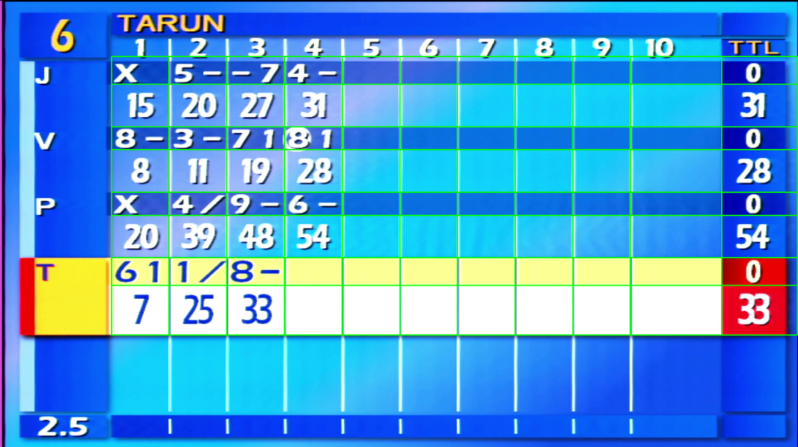

# 🎳 Bowling Scoreboard Extraction


Pulls structured data — per-frame rolls, running totals, player names, lane
number — out of broadcast video of a bowling scoreboard, using a custom
glyph classifier instead of general OCR (which misreads this broadcast's
font — see [Approach](#approach)).



*The calibrated cell grid detected on a real frame from the source video.*

## Quick start

```bash
pip install -r requirements.txt
cd src
python extract_frames.py --video ../data/bowling_scoreboard.mp4 --out ../data/frames --fps 3
python pipeline.py --frames ../data/frames --out ../output/scorecards.json
```

Needs [ffmpeg](https://ffmpeg.org/download.html) and
[Tesseract](https://github.com/UB-Mannheim/tesseract/wiki) on PATH. Hitting
an error? Check [Troubleshooting](#troubleshooting) below first — it covers
the two things most likely to trip up a first run.

## Output

One JSON entry per distinct scorecard state found in the video:

```json
{
  "lane": "6",
  "name": "TARUN",
  "players": {
    "J": {
      "symbols": ["X", "5-", "-7", "4-", "", "", "", "", "", ""],
      "scores":  [15, 20, 27, 31, null, null, null, null, null, null],
      "ttl": 31
    }
  },
  "validation_issues": {}
}
```

`validation_issues` flags anything a bowling-scoring cross-check found
suspect — a non-empty entry means "look at this one," not necessarily wrong.

## Approach

General OCR (Tesseract) was tried first and rejected — it misread this
broadcast's font consistently, reading a clean `9` as nothing at all in
every mode tried. Since the vocabulary is tiny (digits, `X`, `/`, `-`) and
the font is fixed, a small **template-matching classifier** trained on
glyphs from this video's own footage turned out simpler and far more
accurate.

The rest of the pipeline exists because the footage kept breaking
assumptions that seemed safe: the grid isn't pixel-static (the active
bowler's row grows and highlights), a transient animation intermittently
covers part of the grid, and the broadcast shows *provisional* totals
mid-frame. Full account of each problem and its fix is in
**[docs/BUILD_LOG.md](docs/BUILD_LOG.md)**.

```
video → extract frames → dedupe → skip non-scoreboard frames
      → pick layout for current highlight state → mask pin-fall overlay
      → crop cells → recognize (glyph classifier) → validate → JSON
```

## Project layout

```
src/       pipeline code (see BUILD_LOG.md for what each module solves)
config/    calibrated grid geometry + glyph template bank
data/      source video + extracted frames (not committed)
output/    scorecards.json — the result
docs/      build log, documentation PDF, screenshots
```

## Docs


- **[docs/documentation.pdf](docs/documentation.pdf)** — screenshots + explanations (input, code running, detection, output)

---

<details>
<summary><b>Troubleshooting</b></summary>

**`ModuleNotFoundError` despite installing requirements** — you likely have
more than one Python on this machine (conda + system Python, a venv, etc.)
and `pip install` went to a different one than `python` is running. Check
with `python -c "import sys; print(sys.executable)"` before and after
installing. If your prompt shows `(base)`, either `pip install -r
requirements.txt` inside that conda env, or `conda deactivate` and use your
system Python.

**ffmpeg/tesseract "not found" right after installing** — Windows shells
cache PATH until restarted. Either open a fresh terminal, or edit the
fallback paths in [`src/tool_paths.py`](src/tool_paths.py) to point at your
install locations directly.

**Video file not found** — it needs to be at `data/bowling_scoreboard.mp4`
exactly. Browser downloads often append `(1)` if a file with that name
already exists in Downloads — rename it, or a name with spaces/parentheses
will need quoting in every command.

**Pipeline seems to hang** — it prints nothing until finished. On this
video that's ~5-10s for frame extraction, ~30-60s for the full pipeline.
Let it finish rather than interrupting.

</details>

<details>
<summary><b>Recalibrating for a different broadcast graphic</b></summary>

The grid geometry, highlight-state layouts, and glyph templates are all
specific to this video's graphic.

1. `python calibrate.py --frame <a representative frame>` — click-through
   tool that measures the grid's column/row boundaries and saves
   `config/layout.json`.
2. `python build_templates.py` — bootstraps the glyph template bank from a
   frame with known ground truth (edit the ground-truth table at the top of
   the script to match your frame).
3. If the graphic also shifts layout when a row is highlighted, calibrate
   each additional state the same way as step 1, saving to
   `config/layout_<STATE>.json`, and register it in
   [`src/layout_selector.py`](src/layout_selector.py).

</details>
